# Spring Security Demo

Демо‑проект на Spring Boot + Spring Security + H2.

---

## Оглавление

### Проект

1. [Требования](#требования)
2. [Запуск приложения локально](#запуск-приложения-локально)
3. [Доступ к index.html](#доступ-к-indexhtml)
4. [Консоль H2](#консоль-h2)
5. [Что демонстрирует проект](#что-демонстрирует-проект)
6. [Основные endpoint'ы](#основные-endpointы)
7. [Структура проекта](#структура-проекта)
8. [Тесты](#тесты)
9. [Варианты проверки](#варианты-проверки)

### JWT, Токены, Cookie и DPoP — Полный справочник

10. [Что такое JWT](#10-что-такое-jwt)
11. [Структура JWT](#11-структура-jwt)
12. [Кто подписывает и что защищено в JWT](#12-кто-подписывает-и-что-защищено-в-jwt)
13. [Access Token и Refresh Token](#13-access-token-и-refresh-token)
14. [Полный цикл авторизации](#14-полный-цикл-авторизации)
15. [Как API проверяет токены](#15-как-api-проверяет-токены)
16. [Cookie: что это, как с ними работать](#16-cookie-что-это-как-с-ними-работать)
17. [Где хранятся токены](#17-где-хранятся-токены)
18. [Сравнительная таблица хранилищ](#18-сравнительная-таблица-хранилищ)
19. [Cookie: типы и атрибуты](#19-cookie-типы-и-атрибуты)
20. [Области видимости cookie](#20-области-видимости-cookie)
21. [Origin vs Site](#21-origin-vs-site)
22. [Угрозы и защиты](#22-угрозы-и-защиты)
23. [CSRF token](#23-csrf-token)
24. [Привязка токена к клиенту](#24-привязка-токена-к-клиенту)
25. [DPoP: полная схема](#25-dpop-полная-схема)
26. [DPoP: хранение приватного ключа](#26-dpop-хранение-приватного-ключа)
27. [Рекомендуемые схемы для web](#27-рекомендуемые-схемы-для-web)
28. [BFF-паттерн](#28-bff-паттерн)
29. [Шпаргалка](#29-шпаргалка)

---

## Требования

- JDK 21+
- Maven 3.9+

Проверка:
```bash
java -version
mvn -v
```

---

## Запуск приложения локально

Из корня проекта:

### Вариант 1. Через Maven

```bash
mvn clean spring-boot:run
```

### Вариант 2. Через собранный JAR

```bash
mvn clean package
java -jar target/08-spring-security-1.0.0.jar
```

Приложение стартует на порту, указанном в `application.yaml`:

- `http://localhost:8892`

---

## Доступ к index.html

Файл `index.html` лежит в:

```text
src/main/resources/static/index.html
```

После запуска приложения откройте в браузере:

- `http://localhost:8892/`
  или
- `http://localhost:8892/index.html`

---

## Консоль H2

Консоль встроенной БД доступна по адресу:

- `http://localhost:8892/h2-console`

Настройки подключения:

- JDBC URL: `jdbc:h2:mem:springsecurity`
- User Name: `sa`
- Password: пусто

---

## Что демонстрирует проект

Проект показывает основные возможности Spring Security:

- базовые концепции безопасности (Authentication vs Authorization)
- цепочку фильтров Spring Security (Security Filter Chain)
- настройку безопасности через SecurityConfiguration
- Method Security аннотации (@PreAuthorize, @Secured)
- шифрование паролей (BCryptPasswordEncoder)
- управление пользователями, ролями и разрешениями
- сессионное управление
- архитектуру Spring Security
- работу с in-memory базой H2 через JPA

---

## Основные endpoint'ы

### Публичные (без авторизации)

- `GET /api/auth/login` - авторизация пользователя
- `GET /api/security/concepts` - концепции безопасности
- `GET /api/security/filter-chain` - цепочка фильтров
- `GET /api/security/architecture` - архитектура Spring Security
- `GET /api/security/auth-vs-authorization` - отличие Auth от Authorization
- `GET /api/security/method-security` - Method Security
- `GET /api/security/password-encoder` - шифрование паролей
- `GET /api/security/config` - конфигурация безопасности
- `GET /api/security/user-details/{username}` - детали пользователя
- `GET /api/security/events` - события безопасности
- `GET /api/security/glossary` - глоссарий
- `GET /api/security/endpoints` - список endpoint'ов

### Требующие авторизации

- `GET /api/users` - список пользователей
- `GET /api/users/{id}` - получить пользователя по ID
- `POST /api/users` - создать пользователя
- `PUT /api/users/{id}` - обновить пользователя
- `DELETE /api/users/{id}` - удалить пользователя
- `PUT /api/users/{id}/password` - изменить пароль
- `GET /api/roles` - список ролей
- `GET /api/roles/{id}` - получить роль по ID
- `POST /api/roles` - создать роль
- `PUT /api/roles/{id}` - обновить роль
- `DELETE /api/roles/{id}` - удалить роль
- `GET /api/permissions` - список разрешений
- `GET /api/permissions/{id}` - получить разрешение по ID
- `POST /api/permissions` - создать разрешение

---

## Структура проекта

```text
src
├── main
│   ├── java/com/example/springsecurity
│   │   ├── config
│   │   │   ├── DemoDataInitializer.java
│   │   │   └── SecurityConfiguration.java
│   │   ├── controller
│   │   │   ├── AuthController.java
│   │   │   ├── DemoController.java
│   │   │   ├── GlobalExceptionHandler.java
│   │   │   ├── PermissionController.java
│   │   │   ├── RoleController.java
│   │   │   └── UserController.java
│   │   ├── entity
│   │   │   ├── Permission.java
│   │   │   ├── Role.java
│   │   │   └── User.java
│   │   ├── exception
│   │   │   ├── RoleNotFoundException.java
│   │   │   ├── UserAlreadyExistsException.java
│   │   │   └── UserNotFoundException.java
│   │   ├── model
│   │   │   └── ApiModels.java
│   │   ├── repository
│   │   │   ├── PermissionRepository.java
│   │   │   ├── RoleRepository.java
│   │   │   └── UserRepository.java
│   │   └── service
│   │       ├── PermissionService.java
│   │       ├── RoleService.java
│   │       ├── SpringSecurityDemoService.java
│   │       └── UserService.java
│   └── resources
│       ├── static
│       │   └── index.html
│       └── application.yaml
└── test
    └── java/com/example/springsecurity
        ├── Section1_SecurityConceptsTest.java
        ├── Section2_FilterChainTest.java
        ├── Section3_AuthVsAuthorizationTest.java
        ├── Section4_MethodSecurityTest.java
        ├── Section5_SecurityConfigTest.java
        ├── Section6_GlossaryTest.java
        ├── Section7_EndpointsTest.java
        └── Section8_ArchitectureTest.java
```

---

## Тесты

Запуск всех тестов:

```bash
mvn test
```

Проект содержит интеграционные тесты для:

- базовых концепций безопасности
- цепочки фильтров Spring Security
- отличия Authentication от Authorization
- Method Security аннотаций
- конфигурации безопасности
- глоссария терминов
- REST endpoint'ов через MockMvc
- архитектуры Spring Security

---

## Варианты проверки

### 1. Без логина
```bash
curl -i http://localhost:8892/api/users
```
Результат:
- `401` в curl
- или redirect на `/login` в браузере

### 2. Неверный пароль
```bash
curl -i -u admin:wrong http://localhost:8892/api/users
```
- идентификация прошла
- пароль не сошёлся
- 401

### 3. USER идёт в ADMIN endpoint
```bash
curl -i -u user:user123 http://localhost:8892/api/users
```
- аутентификация успешна
- роль `ROLE_USER`
- доступ запрещён
- `403`

### 4. ADMIN проходит
```bash
curl -i -u admin:admin123 http://localhost:8892/api/users
```
- аутентификация успешна
- роль `ROLE_ADMIN`
- метод выполнен
- `200`

---

---

# JWT, Токены, Cookie и DPoP — Полный справочник

---

## 10. Что такое JWT

**JWT (JSON Web Token)** — это **формат токена**, а не механизм авторизации.

Это строка, в которой лежат данные о пользователе и **подпись**, чтобы никто не мог незаметно подменить содержимое.

### Ключевые свойства

- **Можно прочитать** — payload не зашифрован, а закодирован в Base64URL
- **Нельзя незаметно изменить** — подпись ломается при любом изменении
- **Самодостаточный** — серверу часто не нужно ходить в БД для проверки

### Аналогия

JWT — это **прозрачный конверт с печатью**:
- содержимое видно всем
- но подделать печать нельзя

---

## 11. Структура JWT

JWT состоит из трёх частей, разделённых точкой:

```
header.payload.signature
```

### Пример

```
eyJhbGciOiJIUzI1NiJ9.eyJzdWIiOiIxMjMiLCJyb2xlIjoiYWRtaW4ifQ.SflKxwRJ...
```

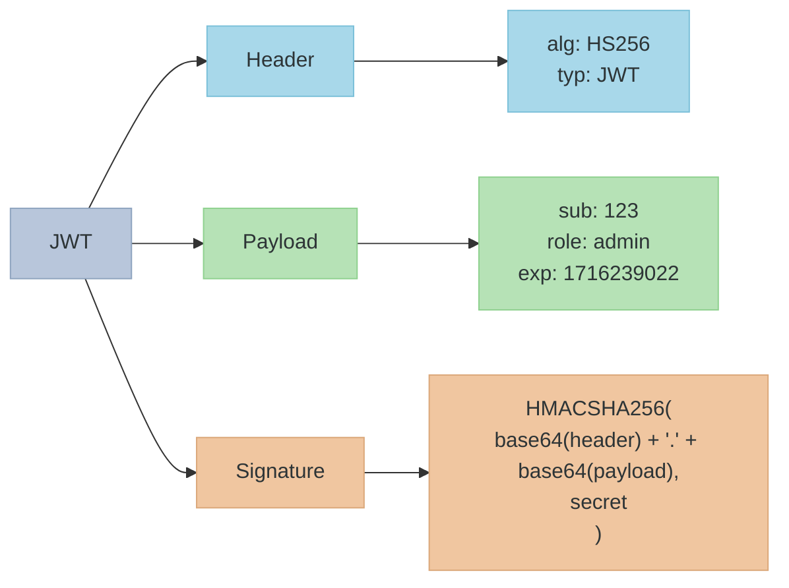
```mermaid
flowchart LR
    A[JWT]:::jwt --> B[Header]:::header
    A --> C[Payload]:::payload
    A --> D[Signature]:::signature

    B --> B1["alg: HS256<br/>typ: JWT"]:::header
    C --> C1["sub: 123<br/>role: admin<br/>exp: 1716239022"]:::payload
    D --> D1["HMACSHA256(<br/>base64(header) + '.' + base64(payload),<br/>secret<br/>)"]:::signature

    classDef jwt fill:#b8c6db,color:#2d3436,stroke:#8fa4bf
    classDef header fill:#a8d8ea,color:#2d3436,stroke:#7bc0d9
    classDef payload fill:#b6e2b6,color:#2d3436,stroke:#8fd18f
    classDef signature fill:#f0c6a0,color:#2d3436,stroke:#dba87a
```

### Header

```json
{
  "alg": "HS256",
  "typ": "JWT"
}
```

### Payload (claims)

```json
{
  "sub": "123",
  "role": "admin",
  "exp": 1716239022
}
```

**Стандартные claims:**

| Claim | Что значит |
|-------|-----------|
| `sub` | subject — id пользователя |
| `iat` | issued at — когда выдан |
| `exp` | expires — когда истекает |
| `nbf` | not before — не раньше какого времени |
| `iss` | issuer — кто выдал |
| `aud` | audience — для кого |
| `jti` | JWT ID — уникальный идентификатор токена |
| `sid` | session ID |

### Signature

Защищает от подделки. Если payload изменить, подпись перестанет совпадать.

### Виды подписи

| Алгоритм | Тип | Кто подписывает | Кто проверяет |
|----------|-----|-----------------|---------------|
| HS256 | Симметричный | shared secret | shared secret |
| RS256 | Асимметричный | private key | public key |


```mermaid
flowchart TD
    subgraph HS["HS256 — симметричный"]
        A1[Auth Server]:::authServer -->|подписывает secret| T1[JWT]:::jwt
        T1 --> A2[API Server]:::apiServer
        A2 -->|проверяет тем же secret| V1[OK / Fail]:::result
    end

    subgraph RS["RS256 — асимметричный"]
        B1[Auth Server]:::authServer -->|подписывает private key| T2[JWT]:::jwt
        T2 --> B2[API Server]:::apiServer
        B2 -->|проверяет public key| V2[OK / Fail]:::result
    end

    classDef authServer fill:#c3aed6,color:#2d3436,stroke:#a68bbf
    classDef apiServer fill:#a8d8ea,color:#2d3436,stroke:#7bc0d9
    classDef jwt fill:#fce8b2,color:#2d3436,stroke:#e6d08f
    classDef result fill:#b6e2b6,color:#2d3436,stroke:#8fd18f

    style HS fill:#f0f0f5,stroke:#c8c8d4,color:#2d3436
    style RS fill:#f0f0f5,stroke:#c8c8d4,color:#2d3436
```

---

## 12. Кто подписывает и что защищено в JWT

### Абстрактная формула

```
Подпись отвечает на два вопроса:

1. Это подписал нужный СУБЪЕКТ?     → КТО подписал
2. Данные не изменились?            → ЧТО защищено
```

### Применяем к каждому типу JWT

#### 1. Access Token (typ: "at+jwt")

| Аспект | Значение |
|--------|----------|
| **КТО подписал** | Authorization Server (своим приватным ключом) |
| **ЧТО защищено** | Claims — утверждения, которые AS гарантирует |

```
{
  "sub": "user123",      // "это пользователь 123"
  "scope": "read write", // "ему разрешено read/write
  "aud": "https://api",  // "токен для этого API"
  "exp": 1700003600,     // "действует до..."
  "cnf": {
    "jkt": "abc..."     // "привязан к этому ключу"
  }
}
```

**Подпись AS означает:**
- пользователь user123 прошёл аутентификацию
- я выдал ему права read и write
- токен предназначен для https://api
- токен действителен до 1700003600
- токен привязан к ключу с thumbprint abc...

Resource Server проверяет подпись публичным ключом AS из JWKS endpoint.

#### 2. DPoP Proof (typ: "dpop+jwt")

| Аспект | Значение |
|--------|----------|
| **КТО подписал** | Клиент (своим приватным ключом) |
| **ЧТО защищено** | Факт обращения — к какому URL, каким методом, когда |

```
Header:
{
  "jwk": { public_key } // "вот мой публичный ключ"
}

Payload:
{
  "htm": "GET",              // "я делаю GET"
  "htu": "https://api/data", // "к этому URL"
  "iat": 1700000000,         // "прямо сейчас"
  "jti": "unique-id",        // "вот уникальный ID"
  "ath": "hash..."          // "с этим токеном"
}
```

AS / RS проверяет подпись публичным ключом ИЗ САМОГО proof (из jwk в header).

#### 3. ID Token (typ: "JWT", OpenID Connect)

| Аспект | Значение |
|--------|----------|
| **КТО подписал** | Authorization Server |
| **ЧТО защищено** | Личность пользователя |

```
{
  "sub": "user123",       // "это пользователь 123"
  "name": "Иван Иванов",  // "его зовут так"
  "email": "ivan@ex.com", // "вот его email"
  "aud": "client-app-id", // "выдан этому клиенту"
  "nonce": "abc123"       // "ответ на этот запрос"
}
```

### Сводная таблица

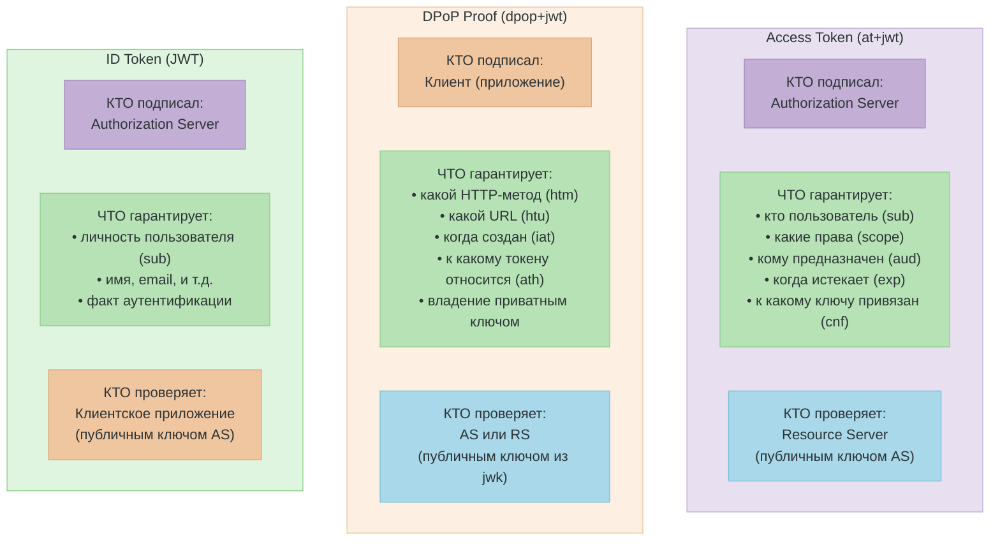
```mermaid
flowchart TB
    subgraph AT["Access Token (at+jwt)"]
        AT_WHO["КТО подписал:<br/>Authorization Server"]:::authServer
        AT_WHAT["ЧТО гарантирует:<br/>• кто пользователь (sub)<br/>• какие права (scope)<br/>• кому предназначен (aud)<br/>• когда истекает (exp)<br/>• к какому ключу привязан (cnf)"]:::info
        AT_VERIFY["КТО проверяет:<br/>Resource Server<br/>(публичным ключом AS)"]:::apiServer
    end

    subgraph DP["DPoP Proof (dpop+jwt)"]
        DP_WHO["КТО подписал:<br/>Клиент (приложение)"]:::client
        DP_WHAT["ЧТО гарантирует:<br/>• какой HTTP-метод (htm)<br/>• какой URL (htu)<br/>• когда создан (iat)<br/>• к какому токену относится (ath)<br/>• владение приватным ключом"]:::info
        DP_VERIFY["КТО проверяет:<br/>AS или RS<br/>(публичным ключом из jwk)"]:::apiServer
    end

    subgraph ID["ID Token (JWT)"]
        ID_WHO["КТО подписал:<br/>Authorization Server"]:::authServer
        ID_WHAT["ЧТО гарантирует:<br/>• личность пользователя (sub)<br/>• имя, email, и т.д.<br/>• факт аутентификации"]:::info
        ID_VERIFY["КТО проверяет:<br/>Клиентское приложение<br/>(публичным ключом AS)"]:::client
    end

    classDef authServer fill:#c3aed6,color:#2d3436,stroke:#a68bbf
    classDef apiServer fill:#a8d8ea,color:#2d3436,stroke:#7bc0d9
    classDef client fill:#f0c6a0,color:#2d3436,stroke:#dba87a
    classDef info fill:#b6e2b6,color:#2d3436,stroke:#8fd18f

    style AT fill:#e8dff0,stroke:#c3aed6,color:#2d3436
    style DP fill:#fdf0e2,stroke:#f0c6a0,color:#2d3436
    style ID fill:#dff5df,stroke:#8fd18f,color:#2d3436
```

### Ключевой момент: подпись защищает ВСЁ содержимое целиком

```
JWT:   header  .  payload  .  signature
            │          │           │
            └────┬─────┘           │
                 │                 │
                 ▼                 │
         sign(header + payload, ───┘
              private_key)

Изменён ЛЮБОЙ символ в header или payload?
→ verify(data, old_signature) = ❌ FAIL
```

### Аналогия

```
Access Token — как ПАСПОРТ
КТО подписал:  государство (AS)
ЧТО внутри:   имя, фото, гражданство, срок действия
ПОДПИСЬ:       голограмма / водяной знак
ПРОВЕРЯЕТ:     пограничник (RS)

Можно прочитать?  Да, данные открыты
Можно подделать?  Нет, голограмма сломается

═══════════════════════════════════════════

DPoP Proof — как ПОДПИСЬ НА ДОКУМЕНТЕ от руки
КТО подписал:  вы лично (клиент)
ЧТО внутри:   "я подтверждаю перевод X на счёт Y"
ПОДПИСЬ:       ваш личный почерк
ПРОВЕРЯЕТ:     банк (RS), сверяя с образцом

Можно прочитать?  Да
Можно подделать?  Нет, почерк уникален
```

---

## 13. Access Token и Refresh Token

### Это не "части JWT"

Это **роли (назначения)** токенов. JWT — это формат. Access/Refresh — это для чего токен нужен.

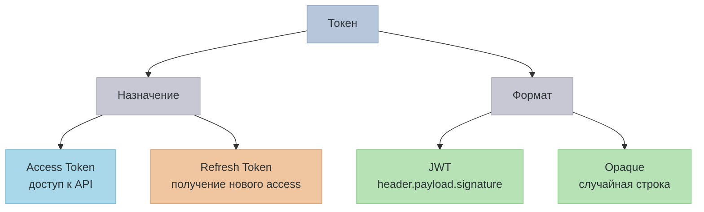
```mermaid
flowchart TD
    A[Токен]:::jwt --> B[Назначение]:::category
    A --> C[Формат]:::category

    B --> D["Access Token<br/>доступ к API"]:::access
    B --> E["Refresh Token<br/>получение нового access"]:::refresh

    C --> F["JWT<br/>header.payload.signature"]:::format
    C --> G["Opaque<br/>случайная строка"]:::format

    classDef jwt fill:#b8c6db,color:#2d3436,stroke:#8fa4bf
    classDef category fill:#c8c8d4,color:#2d3436,stroke:#a8a8b4
    classDef access fill:#a8d8ea,color:#2d3436,stroke:#7bc0d9
    classDef refresh fill:#f0c6a0,color:#2d3436,stroke:#dba87a
    classDef format fill:#b6e2b6,color:#2d3436,stroke:#8fd18f
```

### Сравнение

| | Access Token | Refresh Token |
|---|---|---|
| **Для чего** | доступ к API | получение нового access |
| **Куда отправляется** | в API | только в Auth Server `/refresh` |
| **Срок жизни** | 5–15 минут | 7–30 дней |
| **Формат** | обычно JWT | часто opaque string |
| **Хранится на сервере** | часто нет (JWT) | обычно да (hash в БД) |

### Зачем два токена

Если один долгоживущий токен украдут — злоумышленник пользуется им долго.

Разделение уменьшает ущерб:
- access короткий → окно атаки маленькое
- refresh более защищён → хранится аккуратнее, ротируется

---

## 14. Полный цикл авторизации

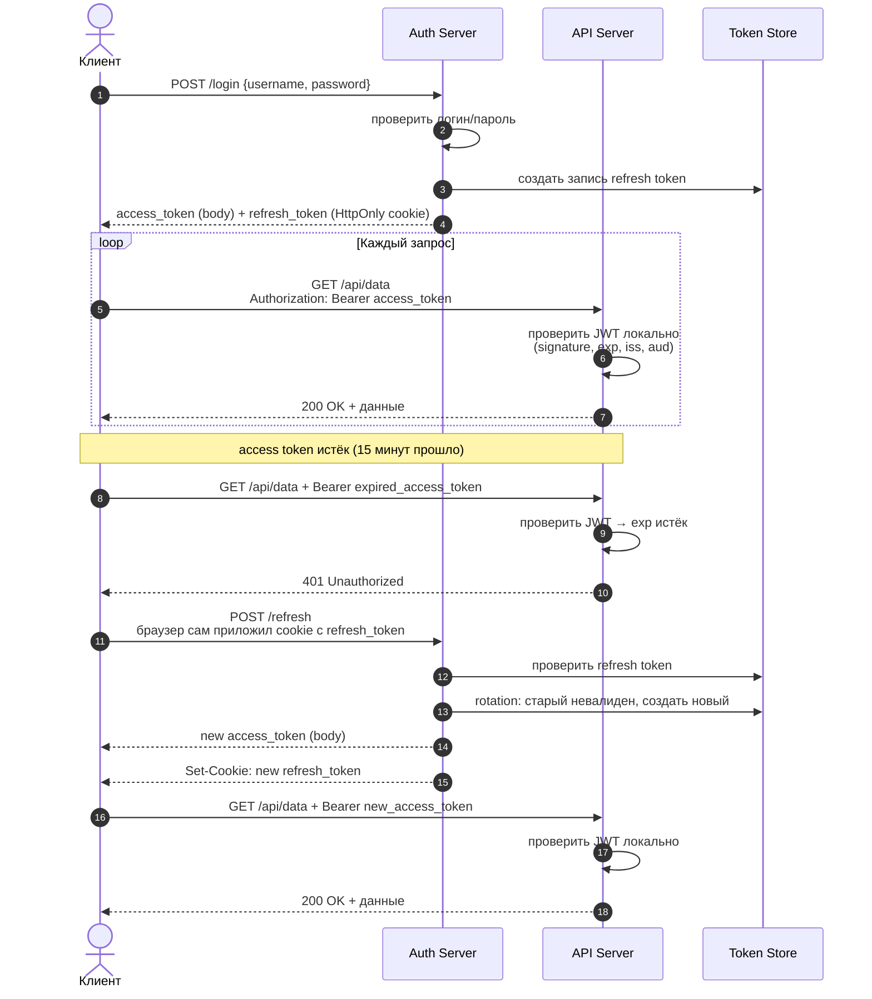
```mermaid
sequenceDiagram
    autonumber
    actor Client as Клиент
    participant Auth as Auth Server
    participant API as API Server
    participant DB as Token Store

    Client->>Auth: POST /login {username, password}
    Auth->>Auth: проверить логин/пароль
    Auth->>DB: создать запись refresh token
    Auth-->>Client: access_token (body) + refresh_token (HttpOnly cookie)

    loop Каждый запрос
        Client->>API: GET /api/data<br/>Authorization: Bearer access_token
        API->>API: проверить JWT локально<br/>(signature, exp, iss, aud)
        API-->>Client: 200 OK + данные
    end

    Note over Client,API: access token истёк (15 минут прошло)

    Client->>API: GET /api/data + Bearer expired_access_token
    API->>API: проверить JWT → exp истёк
    API-->>Client: 401 Unauthorized

    Client->>Auth: POST /refresh<br/>браузер сам приложил cookie с refresh_token
    Auth->>DB: проверить refresh token
    Auth->>DB: rotation: старый невалиден, создать новый
    Auth-->>Client: new access_token (body)
    Auth-->>Client: Set-Cookie: new refresh_token

    Client->>API: GET /api/data + Bearer new_access_token
    API->>API: проверить JWT локально
    API-->>Client: 200 OK + данные
```

---

## 15. Как API проверяет токены

### Если access token = JWT → проверяет сам

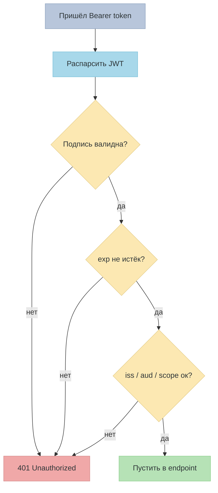
```mermaid
flowchart TD
    A[Пришёл Bearer token]:::start --> B[Распарсить JWT]:::process
    B --> C{Подпись валидна?}:::decision
    C -- нет --> X[401 Unauthorized]:::fail
    C -- да --> D{exp не истёк?}:::decision
    D -- нет --> X
    D -- да --> E{iss / aud / scope ок?}:::decision
    E -- нет --> X
    E -- да --> F[Пустить в endpoint]:::success

    classDef start fill:#b8c6db,color:#2d3436,stroke:#8fa4bf
    classDef process fill:#a8d8ea,color:#2d3436,stroke:#7bc0d9
    classDef decision fill:#fce8b2,color:#2d3436,stroke:#e6d08f
    classDef fail fill:#f0a8a8,color:#2d3436,stroke:#d68b8b
    classDef success fill:#b6e2b6,color:#2d3436,stroke:#8fd18f
```

API **не ходит к Auth Server** на каждый запрос.

Если RS256 — API берёт public key из конфига или из `/.well-known/jwks.json` (кэширует).

### Если access token = opaque → спрашивает Auth Server

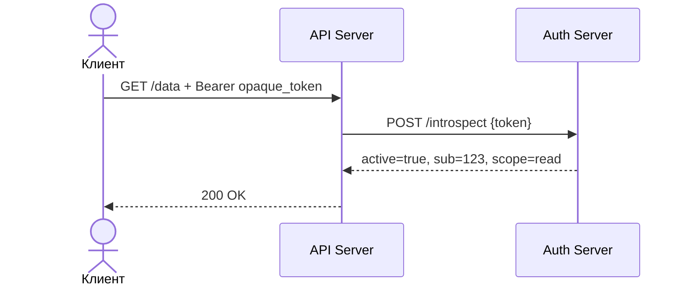
```mermaid
sequenceDiagram
    actor Client as Клиент
    participant API as API Server
    participant Auth as Auth Server

    Client->>API: GET /data + Bearer opaque_token
    API->>Auth: POST /introspect {token}
    Auth-->>API: active=true, sub=123, scope=read
    API-->>Client: 200 OK
```

---

## 16. Cookie: что это, как с ними работать

### Коротко в 30 секунд

- **Cookie** — это не "токен безопасности", а механизм браузера для хранения небольших данных и автоматической отправки их серверу.
- Обычно в cookie хранят:
  - **ID серверной сессии**,
  - **refresh token**,
  - **CSRF token**,
  - иногда **JWT**.
- **Cookie ≠ JWT**.
  Cookie — это контейнер/способ доставки. JWT — формат токена.
- Для браузерных приложений очень часто **лучший и самый скучно-надежный вариант** — это:
  - **короткая серверная сессия**,
  - в cookie: `HttpOnly + Secure + SameSite`,
  - плюс защита от CSRF.

### Ментальная модель: что такое cookie

Cookie — это пара `name=value` + набор атрибутов:

- кто может его получать (`Domain`, `Path`),
- когда оно живет (`Expires`, `Max-Age`),
- можно ли отправлять только по HTTPS (`Secure`),
- может ли JS его читать (`HttpOnly`),
- можно ли отправлять в cross-site контекстах (`SameSite`).

Браузер сам решает:
1. сохранить cookie или нет,
2. на какие запросы его прикреплять,
3. отдавать ли его JavaScript'у.

### Важная путаница

Это разные сущности:
- **Cookie** — механизм браузера.
- **Session ID** — идентификатор сессии, который можно положить в cookie.
- **JWT** — формат токена, который можно положить в cookie или передавать в `Authorization`.
- **CSRF token** — отдельный механизм защиты от CSRF.
- **CORS** — не защита от CSRF и не замена cookie-безопасности.

### Где происходит установка cookie

#### Вариант 1: сервер ставит cookie через `Set-Cookie`

Это основной и правильный путь для чувствительных cookie.

```http
HTTP/1.1 200 OK
Set-Cookie: __Host-session=abc123; Path=/; HttpOnly; Secure; SameSite=Lax; Max-Age=1800
Content-Type: application/json
```

#### Вариант 2: фронт ставит cookie через JS

```js
document.cookie = "theme=dark; Path=/; Max-Age=3600";
```

Но:
- **JavaScript не может поставить `HttpOnly` cookie**.
- **секреты и auth-cookie лучше ставить только с backend**.

### Как cookie живет во взаимодействии backend ↔ frontend

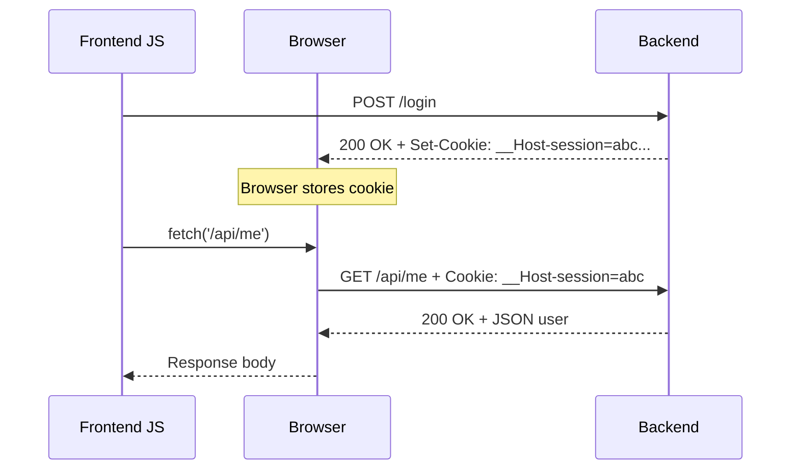
```mermaid
sequenceDiagram
    participant FE as Frontend JS
    participant BR as Browser
    participant BE as Backend

    FE->>BE: POST /login
    BE-->>BR: 200 OK + Set-Cookie: __Host-session=abc...
    Note over BR: Browser stores cookie

    FE->>BR: fetch('/api/me')
    BR->>BE: GET /api/me + Cookie: __Host-session=abc
    BE-->>BR: 200 OK + JSON user
    BR-->>FE: Response body
```

### Атрибуты cookie для auth

Для основной сессионной cookie хороший базовый вариант:

```http
Set-Cookie: __Host-session=<random>; Path=/; HttpOnly; Secure; SameSite=Lax; Max-Age=1800
```

Почему так:
- `__Host-`
  требует:
  - `Secure`
  - `Path=/`
  - **без `Domain`**
    Это очень хороший способ сделать cookie максимально узко scoped.

- `HttpOnly`
  JS не читает

- `Secure`
  только HTTPS

- `SameSite=Lax`
  неплохой баланс для обычного веба

- `Max-Age`
  ограниченный срок жизни

---

## 17. Где хранятся токены

### На клиенте

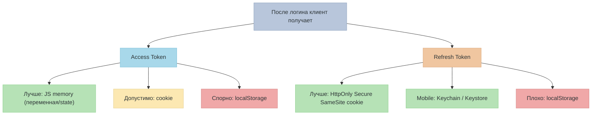
```mermaid
flowchart TD
    A[После логина клиент получает]:::start --> B[Access Token]:::access
    A --> C[Refresh Token]:::refresh

    B --> B1["Лучше: JS memory (переменная/state)"]:::good
    B --> B2["Допустимо: cookie"]:::ok
    B --> B3["Спорно: localStorage"]:::bad

    C --> C1["Лучше: HttpOnly Secure SameSite cookie"]:::good
    C --> C2["Mobile: Keychain / Keystore"]:::good
    C --> C3["Плохо: localStorage"]:::bad

    classDef start fill:#b8c6db,color:#2d3436,stroke:#8fa4bf
    classDef access fill:#a8d8ea,color:#2d3436,stroke:#7bc0d9
    classDef refresh fill:#f0c6a0,color:#2d3436,stroke:#dba87a
    classDef good fill:#b6e2b6,color:#2d3436,stroke:#8fd18f
    classDef ok fill:#fce8b2,color:#2d3436,stroke:#e6d08f
    classDef bad fill:#f0a8a8,color:#2d3436,stroke:#d68b8b
```

### На сервере

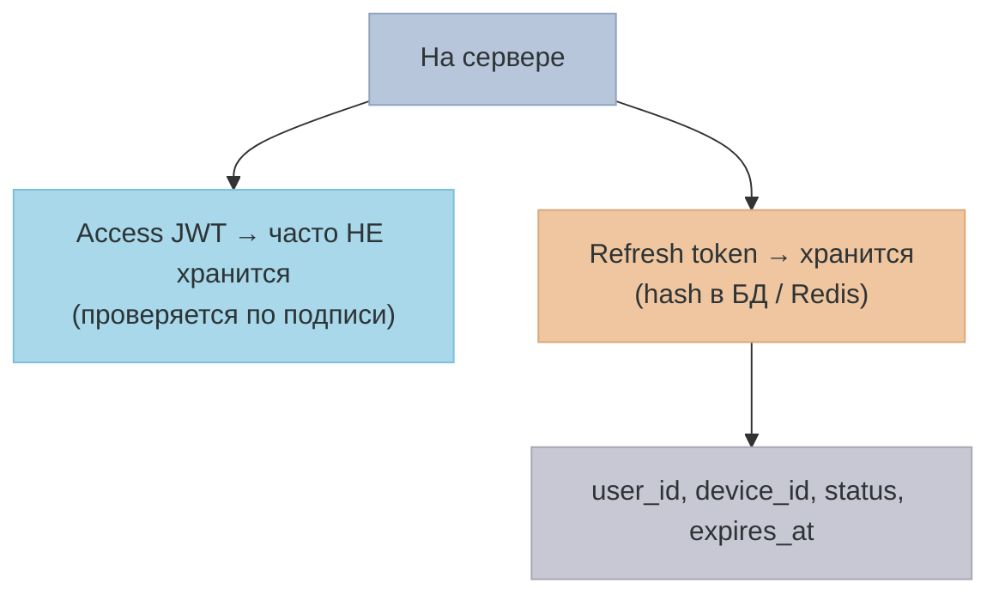
```mermaid
flowchart TD
    D[На сервере]:::start --> E["Access JWT → часто НЕ хранится<br/>(проверяется по подписи)"]:::access
    D --> F["Refresh token → хранится<br/>(hash в БД / Redis)"]:::refresh
    F --> F1["user_id, device_id, status, expires_at"]:::info

    classDef start fill:#b8c6db,color:#2d3436,stroke:#8fa4bf
    classDef access fill:#a8d8ea,color:#2d3436,stroke:#7bc0d9
    classDef refresh fill:#f0c6a0,color:#2d3436,stroke:#dba87a
    classDef info fill:#c8c8d4,color:#2d3436,stroke:#a8a8b4
```

---

## 18. Сравнительная таблица хранилищ

| Хранилище | JS может читать | Живёт после reload | Живёт после закрытия браузера | Браузер шлёт сам | Риск XSS | Риск CSRF | Подходит для |
|---|:---:|:---:|:---:|:---:|:---:|:---:|---|
| **JS memory** (переменная) | ✅ | ❌ | ❌ | ❌ | ⚠️ пока вкладка открыта | ❌ | access token |
| **localStorage** | ✅ | ✅ | ✅ | ❌ | 🔴 легко украсть | ❌ | не рекомендуется для токенов |
| **sessionStorage** | ✅ | ✅ | ❌ | ❌ | 🔴 легко украсть | ❌ | не рекомендуется для токенов |
| **Обычная cookie** | ✅ | ✅ | зависит от Expires | ✅ | 🔴 JS видит | ⚠️ | не рекомендуется для токенов |
| **Session cookie** (без Expires) | ❌ если HttpOnly | ✅ | ❌ обычно | ✅ | ✅ если HttpOnly | ⚠️ | refresh token |
| **Persistent cookie** (с Expires) | ❌ если HttpOnly | ✅ | ✅ | ✅ | ✅ если HttpOnly | ⚠️ | refresh token с "remember me" |

### Практическая таблица выбора подходов

| Подход | Где хранится credential | XSS-эксфильтрация | CSRF | Logout/revoke | Сложность | Когда хорошо |
|---|---|---:|---:|---:|---:|---|
| Session ID в HttpOnly cookie | Cookie + session store | Низкая | Есть риск | Простые | Низкая | Обычный web |
| JWT в HttpOnly cookie | Cookie | Ниже | Есть риск | Сложнее | Средняя | Если нужен JWT, но не хотите JS storage |
| JWT в localStorage + Bearer | JS storage | Высокая | Ниже | Сложнее | Средняя | Обычно не лучший выбор для browser |
| Access in memory + refresh in HttpOnly cookie | Память + cookie | Средняя/ниже | На refresh endpoint есть риск | Средняя | Высокая | SPA с API |
| BFF | Cookie session, токены на сервере | Низкая | Есть риск, но контролируемо | Удобно | Средняя | Современный browser auth |

---

## 19. Cookie: типы и атрибуты

### Cookie — это не "файл на диске"

Cookie — это **запись в cookie-хранилище браузера**, которую браузер автоматически прикладывает к запросам по правилам domain/path/samesite/secure.

Физическое хранение (RAM, sqlite, файлы) — деталь реализации браузера.

### Два логических типа

| Тип | Expires / Max-Age | Живёт после закрытия браузера | Когда использовать |
|-----|:-:|:-:|---|
| **Session cookie** | нет | обычно нет | "залогинен, пока открыт браузер" |
| **Persistent cookie** | да | да | "remember me" |

> **Нюанс:** современные браузеры с session restore могут сохранять session cookies после перезапуска.

### Атрибуты cookie

| Атрибут | Что делает | Зачем нужен |
|---------|-----------|-------------|
| `HttpOnly` | JS не может читать cookie | защита от XSS-кражи |
| `Secure` | отправлять только по HTTPS | защита от перехвата |
| `SameSite=Strict` | не отправлять с других сайтов | защита от CSRF |
| `SameSite=Lax` | не отправлять при POST с других сайтов | мягче Strict |
| `SameSite=None` | отправлять всегда (нужен Secure) | для cross-site сценариев |
| `Max-Age` / `Expires` | срок жизни | persistent vs session |
| `Domain` | для какого домена | scope cookie |
| `Path` | для какого пути | scope cookie |

### Примеры

```http
; Для refresh token (persistent)
Set-Cookie: refresh_token=abc123; HttpOnly; Secure; SameSite=Strict; Path=/api/auth; Max-Age=2592000

; Для refresh token (session)
Set-Cookie: refresh_token=abc123; HttpOnly; Secure; SameSite=Strict; Path=/api/auth

; Для session cookie
Set-Cookie: __Host-session=RANDOM; Path=/; HttpOnly; Secure; SameSite=Lax; Max-Age=1800
```

### Префиксы cookie

#### `__Secure-`

Требует:
- cookie выставлена по HTTPS
- есть атрибут `Secure`

#### `__Host-`

Требует:
- `Secure`
- `Path=/`
- **нет `Domain`**

Для сессии это часто лучший вариант.

```http
Set-Cookie: __Host-session=abc; Path=/; Secure; HttpOnly; SameSite=Lax
```

---

## 20. Области видимости cookie

### Domain

Если `Domain` **не указан**, cookie становится **host-only**:
- поставлено с `api.example.com`
- будет отправляться **только** на `api.example.com`
- **не** будет отправляться на `app.example.com`

Это обычно **лучше и безопаснее**.

Если указать:
```http
Set-Cookie: session=abc; Domain=example.com; Path=/
```
тогда cookie может уходить на:
- `example.com`
- `api.example.com`
- `app.example.com`
- `admin.example.com`

**Риск:** Чем шире `Domain`, тем больше поверхность атаки.

### Path

```http
Set-Cookie: session=abc; Path=/api/
```
Cookie будет отправляться на URL, начинающиеся с `/api/`.

**Но:** `Path` — это **не граница безопасности**. На `Path` нельзя полагаться как на способ изоляции чувствительных данных между приложениями.

### Expires / Max-Age

Определяют срок жизни cookie.
- `Max-Age=1800` — 30 минут
- `Expires=...` — абсолютная дата
- если не задано — часто это **session cookie**, живет до закрытия браузера

### Secure

Означает: cookie отправлять только по HTTPS.

Без `Secure` cookie может утечь по HTTP.

`Secure` не спасает от первого захода по HTTP, если у вас нет **HSTS**.

### HttpOnly

Запрещает доступ к cookie из JavaScript:
- `document.cookie` не увидит его
- XSS не сможет просто прочитать токен

**Очень важно:** `HttpOnly` **не защищает от XSS полностью**.

Если злоумышленник исполнил JS в вашем origin, он может:
- делать запросы от имени пользователя,
- вызывать ваши API,
- менять UI,
- воровать данные из ответов, если политика позволяет.

`HttpOnly` защищает именно от **эксфильтрации cookie**, а не от всего XSS.

### SameSite

Варианты:
- `SameSite=Strict`
- `SameSite=Lax`
- `SameSite=None`

#### `Strict`

Cookie не отправляется в cross-site контексте вообще.
- максимальная защита от CSRF
- может ломать UX, deep links, переходы из почты/мессенджеров/SSO

#### `Lax`

Компромиссный вариант.
- в большинстве cross-site запросов cookie не уйдет,
- но в некоторых top-level navigation сценариях уйти может.
  Это часто **хороший default** для обычной web-сессии.

#### `None`

Cookie можно отправлять и в cross-site контексте.
**Обязательно требует `Secure`**, иначе браузеры его отвергнут.

Нужно, если:
- frontend и backend на разных "сайтах",
- third-party iframe,
- embedded сценарии,
- часть SSO/OAuth сценариев.

**Риск:** `SameSite=None` резко повышает требования к защите от CSRF.

---

## 21. Origin vs Site

Это критично для работы frontend/backend.

### Origin

Состоит из:
- scheme
- host
- port

Например:
- `https://app.example.com`
- `https://api.example.com`

Это **разные origin**.

### Site

Грубо: домен верхнего уровня приложения (`example.com`) + схема.

- `https://app.example.com`
- `https://api.example.com`

Часто это **same-site**, но **cross-origin**.

### Почему это важно

| Для чего | Смотрит на |
|----------|-----------|
| cookie / SameSite | **site** |
| fetch / XHR / CORS | **origin** |

### Практический эффект

Если SPA находится на `https://app.example.com`, а API на `https://api.example.com`:
- для `SameSite` они могут быть **same-site**
- но для `fetch` это **cross-origin**
- значит, JS должен делать:
  ```js
  fetch("https://api.example.com/me", {
    credentials: "include"
  });
  ```
- а backend должен вернуть:
  ```http
  Access-Control-Allow-Origin: https://app.example.com
  Access-Control-Allow-Credentials: true
  Vary: Origin
  ```

И **нельзя** использовать:
```http
Access-Control-Allow-Origin: *
```
если есть `Allow-Credentials: true`.

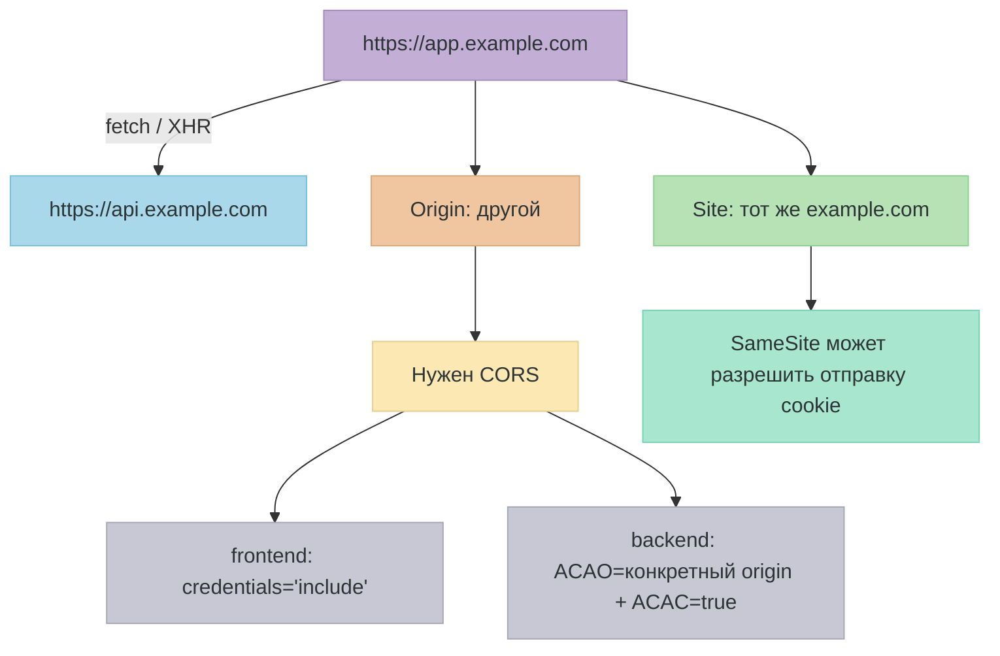
```mermaid
flowchart TD
    A["https://app.example.com"]:::frontend -->|fetch / XHR| B["https://api.example.com"]:::backend
    A --> C["Origin: другой"]:::originInfo
    A --> D["Site: тот же example.com"]:::siteInfo

    C --> E["Нужен CORS"]:::cors
    D --> F["SameSite может разрешить отправку cookie"]:::cookie

    E --> G["frontend: credentials='include'"]:::detail
    E --> H["backend: ACAO=конкретный origin + ACAC=true"]:::detail

    classDef frontend fill:#c3aed6,color:#2d3436,stroke:#a68bbf
    classDef backend fill:#a8d8ea,color:#2d3436,stroke:#7bc0d9
    classDef originInfo fill:#f0c6a0,color:#2d3436,stroke:#dba87a
    classDef siteInfo fill:#b6e2b6,color:#2d3436,stroke:#8fd18f
    classDef cors fill:#fce8b2,color:#2d3436,stroke:#e6d08f
    classDef cookie fill:#a8e6cf,color:#2d3436,stroke:#7ad4b0
    classDef detail fill:#c8c8d4,color:#2d3436,stroke:#a8a8b4
```

### Очень важный момент: CORS не защищает от CSRF

CORS лишь говорит: можно ли **JS-странице прочитать ответ**.

Но даже если CORS не дает прочитать ответ, сам запрос с cookie **может уйти**.

То есть:
- **CORS ≠ защита от CSRF**

---

## 22. Угрозы и защиты

### Основные security-риски cookie

| Угроза | Что происходит | Защита |
|--------|---------------|--------|
| **Перехват в сети** | MITM читает токен | HTTPS, Secure cookie |
| **XSS** | JS крадёт токен | HttpOnly cookie, CSP, санитизация |
| **CSRF** | браузер шлёт cookie на поддельный запрос | SameSite, CSRF-token, проверка Origin |
| **Утечка в URL** | токен попадает в логи/referrer | не класть токены в URL/query params |
| **Кража refresh token** | долгий доступ к аккаунту | rotation, reuse detection, HttpOnly |
| **Устаревшие данные в JWT** | роль изменилась, токен старый | короткий TTL access token |
| **Невозможность отозвать JWT** | пользователь заблокирован, токен живёт | короткий TTL, blacklist, server-side check |
| **Session fixation** | злоумышленник навязывает заранее известный session ID | менять session ID после логина |
| **Cookie tossing / subdomain problems** | любой скомпрометированный субдомен может стать угрозой | host-only cookie, `__Host-` prefix |

### Refresh Token Rotation

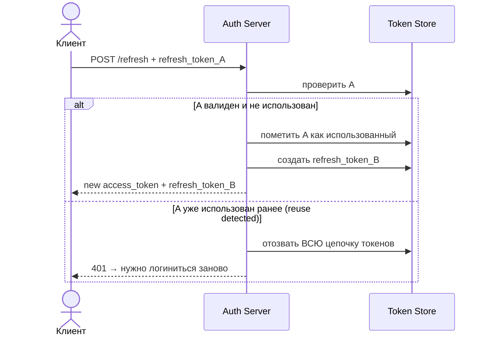
```mermaid
sequenceDiagram
    actor Client as Клиент
    participant Auth as Auth Server
    participant DB as Token Store

    Client->>Auth: POST /refresh + refresh_token_A
    Auth->>DB: проверить A

    alt A валиден и не использован
        Auth->>DB: пометить A как использованный
        Auth->>DB: создать refresh_token_B
        Auth-->>Client: new access_token + refresh_token_B
    else A уже использован ранее (reuse detected)
        Auth->>DB: отозвать ВСЮ цепочку токенов
        Auth-->>Client: 401 → нужно логиниться заново
    end
```

### Защита от CSRF

1. **SameSite**
2. **CSRF token**
3. Проверка `Origin` / `Referer`
4. Не использовать GET для state-changing операций

### CSRF token паттерны

#### Synchronizer token pattern

- сервер создает CSRF token,
- хранит его в сессии на сервере,
- отдает фронту,
- фронт отправляет его в заголовке или форме,
- сервер сравнивает.

**Плюс:** Очень надежный классический подход.
**Минус:** Нужна серверная stateful логика.

#### Double submit cookie

- сервер ставит отдельную **не-HttpOnly** cookie с CSRF token
- frontend читает ее и кладет в заголовок `X-CSRF-Token`
- сервер сравнивает:
  - token из cookie
  - token из header

Злоумышленник с другого сайта не может прочитать cookie и повторить значение в заголовке.

**Плюс:** Работает без хранения CSRF token на сервере.
**Минус:** Требует аккуратной реализации.

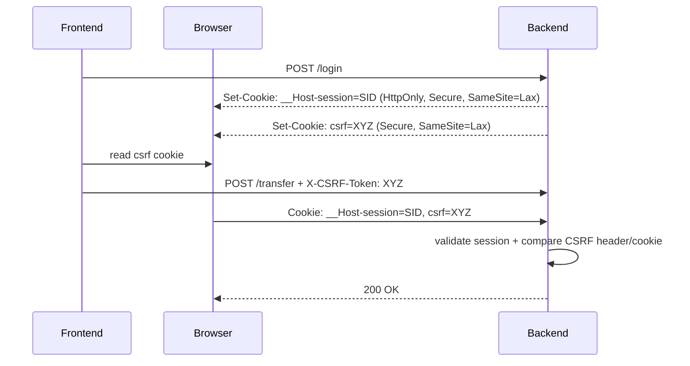
```mermaid
sequenceDiagram
    participant FE as Frontend
    participant BR as Browser
    participant BE as Backend

    FE->>BE: POST /login
    BE-->>BR: Set-Cookie: __Host-session=SID (HttpOnly, Secure, SameSite=Lax)
    BE-->>BR: Set-Cookie: csrf=XYZ (Secure, SameSite=Lax)

    FE->>BR: read csrf cookie
    FE->>BE: POST /transfer + X-CSRF-Token: XYZ
    BR->>BE: Cookie: __Host-session=SID, csrf=XYZ

    BE->>BE: validate session + compare CSRF header/cookie
    BE-->>BR: 200 OK
```

---

## 23. CSRF token

Если auth основан на cookie, то защита от CSRF часто обязательна.

### Где CSRF token и как связан с cookie

Есть два популярных паттерна:

#### 1. Synchronizer token pattern

- сервер создает CSRF token
- хранит его в сессии на сервере
- отдает фронту
- фронт отправляет его в заголовке или форме
- сервер сравнивает

Плюс: Очень надежный классический подход.
Минус: Нужна серверная stateful логика.

#### 2. Double submit cookie

- сервер ставит отдельную **не-HttpOnly** cookie с CSRF token
- frontend читает ее и кладет в заголовок `X-CSRF-Token`
- сервер сравнивает:
  - token из cookie
  - token из header

Злоумышленник с другого сайта не может прочитать cookie и повторить значение в заголовке.

Плюс: Работает без хранения CSRF token на сервере.
Минус: Требует аккуратной реализации.

---

## 24. Привязка токена к клиенту

### JWT сам по себе не делает фингерпринтинг

Но можно привязать токен к клиенту.

### Способы привязки

| Способ | Как работает | Надёжность |
|--------|-------------|-----------|
| Browser fingerprint (IP, UA, canvas) | хэш характеристик браузера кладётся в JWT | 🔴 хрупко, ненадёжно |
| Cookie-binding | сервер выдаёт случайный secret в HttpOnly cookie, хэш кладёт в JWT | 🟢 хорошо для web |
| Session/device record | `sid`/`device_id` в JWT + запись на сервере | 🟢 гибко |
| `cnf` claim + PoP | JWT привязан к ключу клиента | 🟢 сильно |
| DPoP | клиент доказывает владение ключом на каждый запрос | 🟢 очень сильно |
| mTLS-bound tokens | токен привязан к клиентскому сертификату | 🟢 очень сильно |

### Cookie-binding (практичный вариант для web)

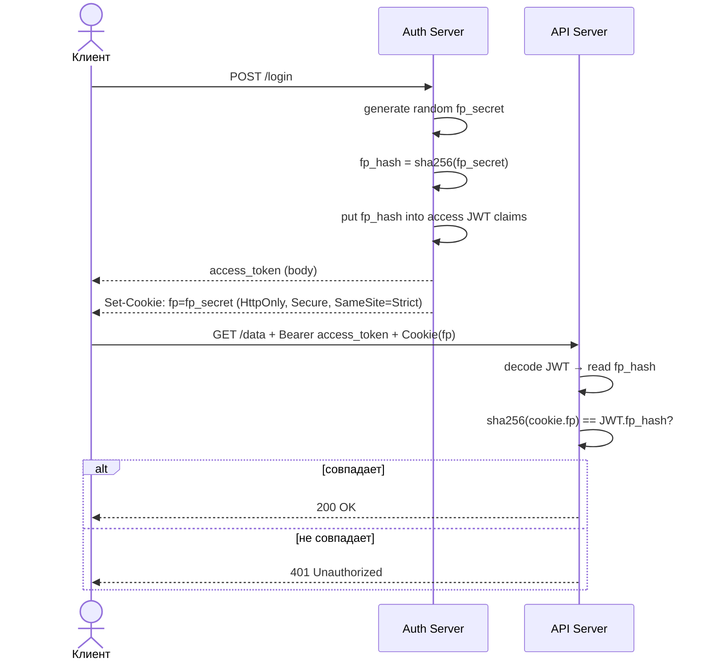
```mermaid
sequenceDiagram
    actor Client as Клиент
    participant Auth as Auth Server
    participant API as API Server

    Client->>Auth: POST /login
    Auth->>Auth: generate random fp_secret
    Auth->>Auth: fp_hash = sha256(fp_secret)
    Auth->>Auth: put fp_hash into access JWT claims
    Auth-->>Client: access_token (body)
    Auth-->>Client: Set-Cookie: fp=fp_secret (HttpOnly, Secure, SameSite=Strict)

    Client->>API: GET /data + Bearer access_token + Cookie(fp)
    API->>API: decode JWT → read fp_hash
    API->>API: sha256(cookie.fp) == JWT.fp_hash?

    alt совпадает
        API-->>Client: 200 OK
    else не совпадает
        API-->>Client: 401 Unauthorized
    end
```

**Смысл:** если злоумышленник украл только JWT (например через лог), но не cookie → токен бесполезен.

---

## 25. DPoP: полная схема

### Что такое DPoP

**DPoP (Demonstrating Proof-of-Possession)** — механизм OAuth 2.0, который привязывает токен к криптографическому ключу клиента.

Суть: клиент доказывает, что владеет приватным ключом, который был использован при получении токена.

### Две пары ключей в системе

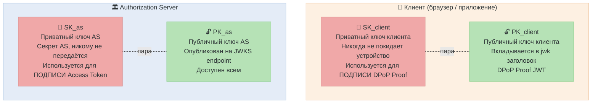
```mermaid
flowchart TB
    subgraph CLIENT["👤 Клиент (браузер / приложение)"]
        SK_C["🔑 SK_client<br/>Приватный ключ клиента<br/>Никогда не покидает устройство<br/>Используется для ПОДПИСИ DPoP Proof"]:::privateKey
        PK_C["🔓 PK_client<br/>Публичный ключ клиента<br/>Вкладывается в jwk заголовок<br/>DPoP Proof JWT"]:::publicKey
    end

    subgraph AS["🏛 Authorization Server"]
        SK_AS["🔑 SK_as<br/>Приватный ключ AS<br/>Секрет AS, никому не передаётся<br/>Используется для ПОДПИСИ Access Token"]:::privateKey
        PK_AS["🔓 PK_as<br/>Публичный ключ AS<br/>Опубликован на JWKS endpoint<br/>Доступен всем"]:::publicKey
    end

    SK_C -.-|"пара"| PK_C
    SK_AS -.-|"пара"| PK_AS

    classDef privateKey fill:#f0a8a8,color:#2d3436,stroke:#d68b8b
    classDef publicKey fill:#b6e2b6,color:#2d3436,stroke:#8fd18f

    style CLIENT fill:#fdf0e2,stroke:#f0c6a0,color:#2d3436
    style AS fill:#e4ecf7,stroke:#a8c4e0,color:#2d3436
```

### Кто что подписывает и кто что проверяет

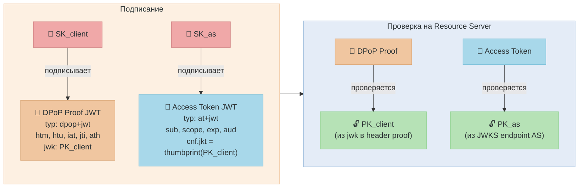
```mermaid
flowchart LR
    subgraph SIGN["Подписание"]
        direction TB
        S1["🔑 SK_client"]:::privateKey -->|"подписывает"| DPOP["📄 DPoP Proof JWT<br/>typ: dpop+jwt<br/>htm, htu, iat, jti, ath<br/>jwk: PK_client"]:::dpop
        S2["🔑 SK_as"]:::privateKey -->|"подписывает"| AT["📄 Access Token JWT<br/>typ: at+jwt<br/>sub, scope, exp, aud<br/>cnf.jkt = thumbprint(PK_client)"]:::access
    end

    subgraph VERIFY["Проверка на Resource Server"]
        direction TB
        DPOP2["📄 DPoP Proof"]:::dpop -->|"проверяется"| V1["🔓 PK_client<br/>(из jwk в header proof)"]:::publicKey
        AT2["📄 Access Token"]:::access -->|"проверяется"| V2["🔓 PK_as<br/>(из JWKS endpoint AS)"]:::publicKey
    end

    SIGN --> VERIFY

    classDef privateKey fill:#f0a8a8,color:#2d3436,stroke:#d68b8b
    classDef publicKey fill:#b6e2b6,color:#2d3436,stroke:#8fd18f
    classDef dpop fill:#f0c6a0,color:#2d3436,stroke:#dba87a
    classDef access fill:#a8d8ea,color:#2d3436,stroke:#7bc0d9

    style SIGN fill:#fdf0e2,stroke:#f0c6a0,color:#2d3436
    style VERIFY fill:#e4ecf7,stroke:#a8c4e0,color:#2d3436
```

### Полный цикл работы с DPoP

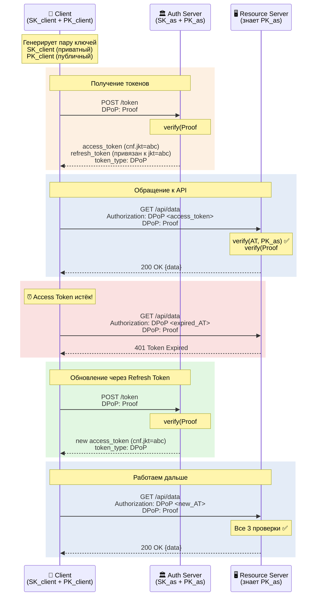
```mermaid
sequenceDiagram
    participant C as 👤 Client<br/>(SK_client + PK_client)
    participant AS as 🏛 Auth Server<br/>(SK_as + PK_as)
    participant RS as 🖥 Resource Server<br/>(знает PK_as)

    Note over C: Генерирует пару ключей<br/>SK_client (приватный)<br/>PK_client (публичный)

    rect rgb(253, 240, 226)
        Note over C,AS: Получение токенов
        C->>AS: POST /token<br/>DPoP: Proof #1 (signed SK_client, htm=POST, htu=/token)<br/>grant_type=authorization_code&code=XYZ
        Note over AS: verify(Proof#1, PK_client) ✅<br/>jkt = thumbprint(PK_client)<br/>sign(AT, SK_as)
        AS-->>C: access_token (cnf.jkt=abc)<br/>refresh_token (привязан к jkt=abc)<br/>token_type: DPoP
    end

    rect rgb(228, 236, 247)
        Note over C,RS: Обращение к API
        C->>RS: GET /api/data<br/>Authorization: DPoP <access_token><br/>DPoP: Proof #2 (signed SK_client, htm=GET, htu=/api/data, ath=hash(AT))
        Note over RS: verify(AT, PK_as) ✅<br/>verify(Proof#2, PK_client) ✅<br/>thumbprint(PK_client) == cnf.jkt ✅
        RS-->>C: 200 OK {data}
    end

    rect rgb(250, 225, 225)
        Note over C: ⏰ Access Token истёк!
        C->>RS: GET /api/data<br/>Authorization: DPoP <expired_AT><br/>DPoP: Proof #3
        RS-->>C: 401 Token Expired
    end

    rect rgb(226, 247, 226)
        Note over C,AS: Обновление через Refresh Token
        C->>AS: POST /token<br/>DPoP: Proof #4 (signed SK_client, htm=POST, htu=/token)<br/>grant_type=refresh_token&refresh_token=ref_xyz
        Note over AS: verify(Proof#4, PK_client) ✅<br/>thumbprint(PK_client) == jkt<br/>привязанный к refresh_token? ✅<br/>Выдаю новый AT
        AS-->>C: new access_token (cnf.jkt=abc)<br/>token_type: DPoP
    end

    rect rgb(228, 236, 247)
        Note over C,RS: Работаем дальше
        C->>RS: GET /api/data<br/>Authorization: DPoP <new_AT><br/>DPoP: Proof #5 (signed SK_client)
        Note over RS: Все 3 проверки ✅
        RS-->>C: 200 OK {data}
    end
```

### Что если Refresh Token украден?

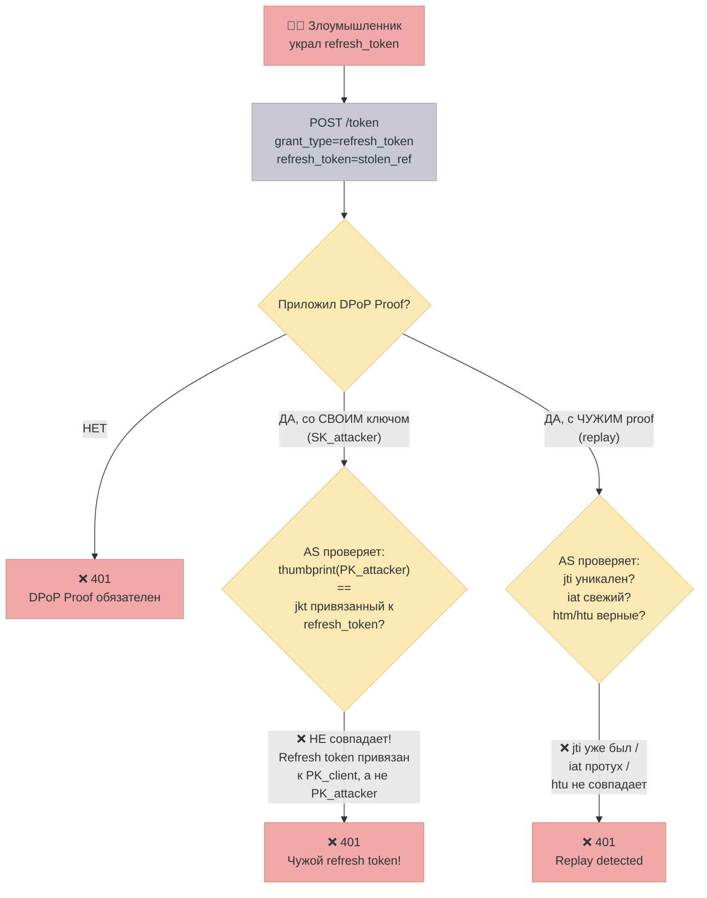
```mermaid
flowchart TB
    STOLEN["🏴‍☠️ Злоумышленник<br/>украл refresh_token"]:::attacker --> ATTEMPT

    ATTEMPT["POST /token<br/>grant_type=refresh_token<br/>refresh_token=stolen_ref"]:::request

    ATTEMPT --> Q1{"Приложил DPoP Proof?"}:::decision

    Q1 -->|"НЕТ"| FAIL1["❌ 401<br/>DPoP Proof обязателен"]:::fail

    Q1 -->|"ДА, со СВОИМ ключом<br/>(SK_attacker)"| CHECK_BIND

    CHECK_BIND{"AS проверяет:<br/>thumbprint(PK_attacker)<br/>==<br/>jkt привязанный к<br/>refresh_token?"}:::decision

    CHECK_BIND -->|"❌ НЕ совпадает!<br/>Refresh token привязан<br/>к PK_client, а не PK_attacker"| FAIL2["❌ 401<br/>Чужой refresh token!"]:::fail

    Q1 -->|"ДА, с ЧУЖИМ proof<br/>(replay)"| CHECK_REPLAY

    CHECK_REPLAY{"AS проверяет:<br/>jti уникален?<br/>iat свежий?<br/>htm/htu верные?"}:::decision

    CHECK_REPLAY -->|"❌ jti уже был /<br/>iat протух /<br/>htu не совпадает"| FAIL3["❌ 401<br/>Replay detected"]:::fail

    classDef attacker fill:#f0a8a8,color:#2d3436,stroke:#d68b8b
    classDef request fill:#c8c8d4,color:#2d3436,stroke:#a8a8b4
    classDef decision fill:#fce8b2,color:#2d3436,stroke:#e6d08f
    classDef fail fill:#f0a8a8,color:#2d3436,stroke:#d68b8b
```

### Итоговая сводка DPoP

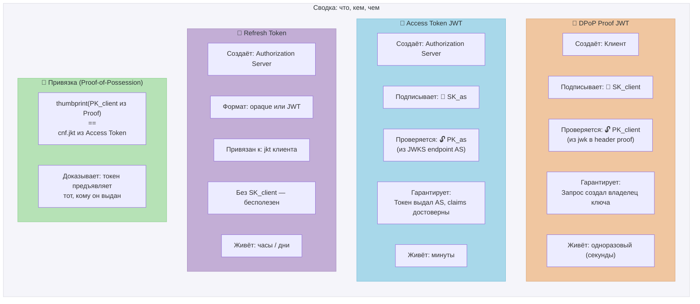
```mermaid
flowchart TB
    subgraph SUMMARY["Сводка: что, кем, чем"]
        direction TB

        subgraph DPOP_JWT["📄 DPoP Proof JWT"]
            D1["Создаёт: Клиент"]
            D2["Подписывает: 🔑 SK_client"]
            D3["Проверяется: 🔓 PK_client<br/>(из jwk в header proof)"]
            D4["Гарантирует:<br/>Запрос создал владелец ключа"]
            D5["Живёт: одноразовый (секунды)"]
        end

        subgraph AT_JWT["📄 Access Token JWT"]
            A1["Создаёт: Authorization Server"]
            A2["Подписывает: 🔑 SK_as"]
            A3["Проверяется: 🔓 PK_as<br/>(из JWKS endpoint AS)"]
            A4["Гарантирует:<br/>Токен выдал AS, claims достоверны"]
            A5["Живёт: минуты"]
        end

        subgraph RT["🔄 Refresh Token"]
            R1["Создаёт: Authorization Server"]
            R2["Формат: opaque или JWT"]
            R3["Привязан к: jkt клиента"]
            R4["Без SK_client — бесполезен"]
            R5["Живёт: часы / дни"]
        end

        subgraph BINDING["🔗 Привязка (Proof-of-Possession)"]
            B1["thumbprint(PK_client из Proof)<br/>==<br/>cnf.jkt из Access Token"]
            B2["Доказывает: токен предъявляет<br/>тот, кому он выдан"]
        end
    end

    style SUMMARY fill:#f5f5fa,stroke:#dcdce4,color:#2d3436
    style DPOP_JWT fill:#f0c6a0,color:#2d3436,stroke:#dba87a
    style AT_JWT fill:#a8d8ea,color:#2d3436,stroke:#7bc0d9
    style RT fill:#c3aed6,color:#2d3436,stroke:#a68bbf
    style BINDING fill:#b6e2b6,color:#2d3436,stroke:#8fd18f
```

---

## 26. DPoP: хранение приватного ключа

### Общая картина: лестница безопасности

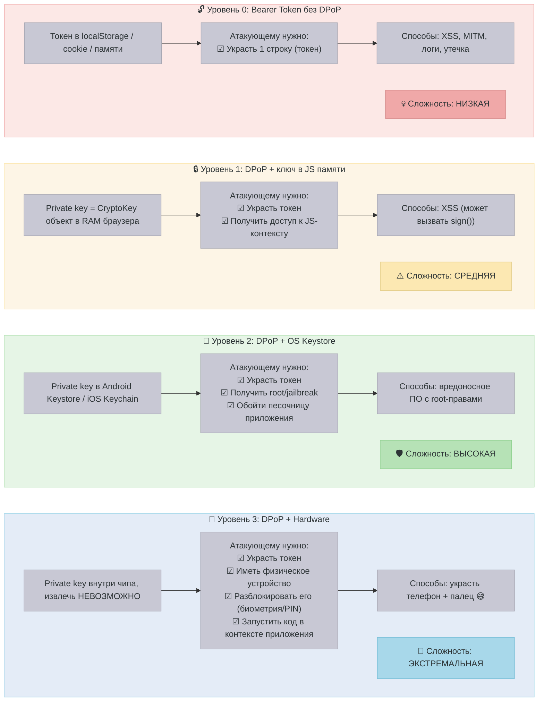
```mermaid
flowchart TB
    subgraph L0["🔓 Уровень 0: Bearer Token без DPoP"]
        A0_1["Токен в localStorage / cookie / памяти"]:::info
        A0_2["Атакующему нужно:<br/>☑ Украсть 1 строку (токен)"]:::info
        A0_3["Способы: XSS, MITM, логи, утечка"]:::info
        A0_1 --> A0_2 --> A0_3
        A0_4["💀 Сложность: НИЗКАЯ"]:::dangerBadge
    end

    subgraph L1["🔒 Уровень 1: DPoP + ключ в JS памяти"]
        A1_1["Private key = CryptoKey объект в RAM браузера"]:::info
        A1_2["Атакующему нужно:<br/>☑ Украсть токен<br/>☑ Получить доступ к JS-контексту"]:::info
        A1_3["Способы: XSS (может вызвать sign())"]:::info
        A1_1 --> A1_2 --> A1_3
        A1_4["⚠️ Сложность: СРЕДНЯЯ"]:::warnBadge
    end

    subgraph L2["🔐 Уровень 2: DPoP + OS Keystore"]
        A2_1["Private key в Android Keystore / iOS Keychain"]:::info
        A2_2["Атакующему нужно:<br/>☑ Украсть токен<br/>☑ Получить root/jailbreak<br/>☑ Обойти песочницу приложения"]:::info
        A2_3["Способы: вредоносное ПО с root-правами"]:::info
        A2_1 --> A2_2 --> A2_3
        A2_4["🛡 Сложность: ВЫСОКАЯ"]:::safeBadge
    end

    subgraph L3["🏰 Уровень 3: DPoP + Hardware"]
        A3_1["Private key внутри чипа, извлечь НЕВОЗМОЖНО"]:::info
        A3_2["Атакующему нужно:<br/>☑ Украсть токен<br/>☑ Иметь физическое устройство<br/>☑ Разблокировать его (биометрия/PIN)<br/>☑ Запустить код в контексте приложения"]:::info
        A3_3["Способы: украсть телефон + палец 😅"]:::info
        A3_1 --> A3_2 --> A3_3
        A3_4["🏰 Сложность: ЭКСТРЕМАЛЬНАЯ"]:::fortBadge
    end

    L0 ~~~ L1 ~~~ L2 ~~~ L3

    classDef info fill:#c8c8d4,color:#2d3436,stroke:#a8a8b4
    classDef dangerBadge fill:#f0a8a8,color:#2d3436,stroke:#d68b8b
    classDef warnBadge fill:#fce8b2,color:#2d3436,stroke:#e6d08f
    classDef safeBadge fill:#b6e2b6,color:#2d3436,stroke:#8fd18f
    classDef fortBadge fill:#a8d8ea,color:#2d3436,stroke:#7bc0d9

    style L0 fill:#fce8e6,stroke:#f0a8a8,color:#2d3436
    style L1 fill:#fdf5e6,stroke:#fce8b2,color:#2d3436
    style L2 fill:#e6f5e6,stroke:#b6e2b6,color:#2d3436
    style L3 fill:#e4ecf7,stroke:#a8d8ea,color:#2d3436
```

### Детальное сравнение уровней

```
════════════════════════════════════════════════════════════════════
  Уровень 0: Bearer Token (без DPoP)
════════════════════════════════════════════════════════════════════

  Клиент                          Атакующий
  ┌─────────────────┐
  │  access_token   │──── XSS / MITM / логи ────► 🏴‍☠️ Готово!
  │  "eyJhbGci..."  │            простая строка       Полный доступ
  └─────────────────┘

  Что нужно украсть:  ☑ access_token
  Итого:              1 вещь, это просто строка
  Защита:             ❌ никакой привязки к владельцу

════════════════════════════════════════════════════════════════════
  Уровень 1: DPoP + ключ в JS памяти браузера
════════════════════════════════════════════════════════════════════

  Браузер (SPA)
  ┌─────────────────────────────────────────────┐
  │                                             │
  │  access_token ─── XSS может прочитать ──────┼──► 🏴‍☠️ Есть!
  │                                             │
  │  CryptoKey {                                │
  │    extractable: false  ◄── нельзя           │
  │    privateKey: [opaque]    экспортировать!   │
  │  }                                         │
  │    │                                        │
  │    └── НО: XSS может вызвать ──────────────┼──► 🏴‍☠️ Может
  │       crypto.subtle.sign(privateKey, data)  │     подписать
  │       прямо в контексте страницы            │     в реальном
  │                                             │     времени
  └─────────────────────────────────────────────┘

  Что нужно:   ☑ XSS-уязвимость в приложении
               ☑ Выполнить код в контексте страницы
               ☑ Нельзя унести ключ — нужно действовать "на месте"
  Защита:      🟡 Ключ не извлекаем, но XSS позволяет им пользоваться

════════════════════════════════════════════════════════════════════
  Уровень 2: DPoP + OS Keystore (мобильное / десктопное приложение)
════════════════════════════════════════════════════════════════════

  Устройство
  ┌─────────────────────────────────────────────┐
  │  Приложение (песочница)                     │
  │  ┌────────────────────┐                     │
  │  │ access_token       │                     │
  │  │                    │                     │
  │  │ Keystore API ──────┼──► OS Keystore      │
  │  │  .sign(alias, data)│   ┌──────────────┐  │
  │  │                    │   │ Private Key   │  │
  │  └────────────────────┘   │ (зашифрован)  │  │
  │         ▲                 │ Доступ только  │  │
  │         │                 │ для app с      │  │
  │    Нужен root +           │ правильным     │  │
  │    обход песочницы        │ подписью)      │  │
  │    чтобы добраться        └──────────────┘  │
  │                                             │
  └─────────────────────────────────────────────┘

                    │
                    ▼ Атакующий
                   🏴‍☠️
  Нужно:   ☑ Вредоносное ПО на устройстве
           ☑ Получить root/jailbreak
           ☑ Обойти изоляцию приложения
           ☑ Подделать подпись вызывающего приложения
  Защита:  🟢 ОС активно защищает хранилище

════════════════════════════════════════════════════════════════════
  Уровень 3: DPoP + Hardware Security (TPM / Secure Enclave / StrongBox)
════════════════════════════════════════════════════════════════════

  Устройство
  ┌─────────────────────────────────────────────┐
  │  Приложение                                 │
  │  ┌────────────────────┐                     │
  │  │ access_token       │                     │
  │  │                    │                     │
  │  │ sign(data) ────────┼──────┐              │
  │  └────────────────────┘      │              │
  │                              ▼              │
  │                    ┌──────────────────┐      │
  │                    │ ╔══════════════╗ │      │
  │                    │ ║  HARDWARE    ║ │      │
  │                    │ ║  CHIP        ║ │      │
  │                    │ ║             ║ │      │
  │                    │ ║ Private Key  ║ │      │
  │                    │ ║ (генерирован ║ │      │
  │                    │ ║  ВНУТРИ чипа,║ │      │
  │                    │ ║  НИКОГДА не  ║ │      │
  │                    │ ║  покидает)   ║ │      │
  │                    │ ║             ║ │      │
  │                    │ ║  data ──► 🔏 ║ │      │
  │                    │ ║       signature║│      │
  │                    │ ╚══════════════╝ │      │
  │                    │  Secure Enclave   │      │
  │                    └──────────────────┘      │
  │                              │               │
  │                              ▼               │
  │                         signature            │
  │                    (только результат)         │
  └─────────────────────────────────────────────┘

                    │
                    ▼ Атакующий
                   🏴‍☠️
  Нужно:   ☑ Физическое владение устройством
           ☑ Разблокировка (биометрия / PIN)
           ☑ Запуск легитимного приложения
           ☑ Даже root НЕ поможет извлечь ключ из чипа!
  Защита:  🟢🟢🟢 Ключ ФИЗИЧЕСКИ неизвлекаем
```

### Итоговое сравнение

```mermaid
flowchart LR
    subgraph "Что нужно украсть"
        direction TB
        B["🔓 Bearer<br/>─────────<br/>1. Токен<br/><br/>Всё."]:::bearer
        D1["🔒 DPoP + JS<br/>─────────<br/>1. Токен<br/>2. XSS в контексте<br/>   страницы<br/>3. Действовать<br/>   в реальном<br/>   времени"]:::dpopJs
        D2["🔐 DPoP + Keystore<br/>─────────<br/>1. Токен<br/>2. Root на<br/>   устройстве<br/>3. Обход<br/>   песочницы<br/>4. Подделка<br/>   подписи app"]:::dpopKs
        D3["🏰 DPoP + Hardware<br/>─────────<br/>1. Токен<br/>2. Само устройство<br/>3. Палец/лицо/PIN<br/>4. Код в контексте<br/>   приложения<br/><br/>Извлечь ключ<br/>НЕВОЗМОЖНО"]:::dpopHw
    end

    B --->|"+DPoP"| D1 --->|"+Keystore"| D2 --->|"+Hardware"| D3

    classDef bearer fill:#f0a8a8,color:#2d3436,stroke:#d68b8b
    classDef dpopJs fill:#fce8b2,color:#2d3436,stroke:#e6d08f
    classDef dpopKs fill:#b6e2b6,color:#2d3436,stroke:#8fd18f
    classDef dpopHw fill:#a8d8ea,color:#2d3436,stroke:#7bc0d9
```

```
Стоимость атаки:

Bearer        ██░░░░░░░░░░░░░░░░░░  ~10%   "Перехватил строку"
DPoP + JS     ██████░░░░░░░░░░░░░░  ~30%   "Нужен XSS + реалтайм"
DPoP + KS     ████████████░░░░░░░░  ~60%   "Нужен root + обход ОС"
DPoP + HW     ████████████████████  ~99%   "Нужно устройство + биометрия"
```

> **Каждый уровень не устраняет риск полностью, а экспоненциально увеличивает стоимость и сложность атаки — именно это и называется defence in depth.**

---

## 27. Рекомендуемые схемы для web

### JWT — индустриальный стандарт?

**Да:**
- как формат токена — да, стандарт и очень распространен
- в OAuth/OIDC — да, очень типично

**Нет:**
- как единственно правильный способ auth в браузере — нет
- как обязательный выбор вместо session cookie — нет
- как "более безопасный сам по себе" — нет

### Где JWT реально уместен

1. **OAuth2 / OpenID Connect** — ID tokens почти всегда JWT, access token часто JWT
2. **Service-to-service** — когда сервисы валидируют токен без обращения к центральной сессии
3. **Распределенные системы** — когда нужны claims прямо внутри токена

### Где JWT часто переиспользуют зря

Обычное web-приложение с браузером и backend'ом. Там очень часто проще и безопаснее:
- серверная сессия,
- opaque session ID в cookie.

### Базовая схема для SPA

```
Access token:  JWT, 5–15 мин, в JS memory
Refresh token: opaque, 7–30 дней, в HttpOnly Secure SameSite cookie
```

### Чеклист

- [ ] Access token — в памяти приложения, не в localStorage
- [ ] Refresh token — в `HttpOnly; Secure; SameSite=Strict` cookie
- [ ] Access TTL — 5–15 минут
- [ ] Refresh rotation при каждом использовании
- [ ] Reuse detection
- [ ] HTTPS only
- [ ] Не класть токены в URL
- [ ] CSP + защита от XSS
- [ ] Не хранить секретные данные в JWT payload
- [ ] Проверять exp, iss, aud на сервере
- [ ] Отзывать refresh при logout / смене пароля

### Полная рекомендуемая схема

```mermaid
sequenceDiagram
    autonumber
    actor Browser as Браузер
    participant Auth as Auth Server
    participant API as API Server
    participant DB as Token Store

    Browser->>Auth: POST /login {email, password}
    Auth->>Auth: проверить credentials
    Auth->>Auth: создать access JWT (15 min)
    Auth->>DB: сохранить hash(refresh_token)
    Auth-->>Browser: access_token в response body
    Auth-->>Browser: Set-Cookie: refresh_token=R1 (HttpOnly, Secure, SameSite=Strict)

    Note over Browser: access_token хранится в JS memory

    loop Обычные запросы
        Browser->>API: GET /api/data<br/>Authorization: Bearer access_token
        API->>API: verify JWT signature + exp + iss + aud
        API-->>Browser: 200 OK
    end

    Note over Browser,API: access token истёк

    Browser->>API: GET /api/data + expired access_token
    API-->>Browser: 401 Unauthorized

    Browser->>Auth: POST /auth/refresh<br/>Cookie: refresh_token=R1 (автоматически)
    Auth->>DB: check hash(R1)

    alt R1 валиден
        Auth->>DB: invalidate R1, create R2
        Auth->>Auth: create new access JWT
        Auth-->>Browser: new access_token (body)
        Auth-->>Browser: Set-Cookie: refresh_token=R2
    else R1 уже использован (reuse)
        Auth->>DB: revoke entire session
        Auth-->>Browser: 401 → re-login
    end

    Browser->>API: GET /api/data + new access_token
    API-->>Browser: 200 OK
```

### Сценарии и рекомендации

#### Сценарий 1. Обычный web-app / monolith

**Рекомендация:**
- server session
- cookie: `__Host-session; HttpOnly; Secure; SameSite=Lax`
- rotate after login
- CSRF token для state-changing запросов
- Origin check
- HSTS

#### Сценарий 2. SPA на `app.example.com`, API на `api.example.com`

**Рекомендация:**
- тоже можно session cookie
- cookie ставит **API host**
- без `Domain`, host-only
- frontend делает `credentials: "include"`
- backend на CORS:
  - exact origin
  - credentials allowed
- CSRF обязательно продумать

#### Сценарий 3. SPA на одном "сайте", но хочется JWT

**Рекомендация:**
- access token короткий, лучше в памяти
- refresh token в HttpOnly cookie
- rotation refresh token
- не хранить refresh token в localStorage

#### Сценарий 4. Browser + external APIs + OAuth/OIDC

Лучше часто использовать **BFF (Backend for Frontend)**.

---

## 28. BFF-паттерн

```mermaid
flowchart LR
    U[Browser]:::browser -->|Cookie session| BFF[Backend for Frontend]:::bff
    BFF -->|OAuth/OIDC tokens server-side| AS[Auth Server]:::authServer
    BFF -->|API calls| API[Resource API]:::apiServer

    U --> X["JS cannot read<br/>HttpOnly session cookie"]:::note
    BFF --> Y[Tokens stay on server side]:::note
    Y --> Z[Less XSS token theft risk]:::good

    classDef browser fill:#c3aed6,color:#2d3436,stroke:#a68bbf
    classDef bff fill:#f0c6a0,color:#2d3436,stroke:#dba87a
    classDef authServer fill:#a8d8ea,color:#2d3436,stroke:#7bc0d9
    classDef apiServer fill:#b6e2b6,color:#2d3436,stroke:#8fd18f
    classDef note fill:#c8c8d4,color:#2d3436,stroke:#a8a8b4
    classDef good fill:#b6e2b6,color:#2d3436,stroke:#8fd18f
```

### Почему это хорошо

- браузер не держит access/refresh token как bearer-секреты,
- меньше поверхность для XSS-эксфильтрации,
- проще централизовать refresh/revoke.

### Opaque session ID vs JWT

#### Opaque session ID в cookie

В cookie лежит просто случайный идентификатор:
```http
Set-Cookie: __Host-session=7f1c...; Path=/; HttpOnly; Secure; SameSite=Lax
```

А на сервере:
- Redis / DB / session store
- user id
- roles
- CSRF context
- device/session metadata
- revoke/logout

**Плюсы:**
- легко инвалидировать
- легко logout everywhere
- легко сменить права
- просто и надежно
- маленькая cookie

**Минусы:**
- нужен серверный storage

#### JWT в cookie

В cookie лежит сам токен со claims.

**Плюсы:**
- можно валидировать локально
- удобно в части распределенных систем

**Минусы:**
- revoke/logout сложнее
- claims могут устаревать
- размер больше
- cookie все равно остается cookie со всеми CSRF-последствиями

---

## 29. Шпаргалка

### JWT

```
JWT = header.payload.signature
Читать можно. Подделать нельзя. Это формат, не механизм авторизации.
```

### Access vs Refresh

```
Access  = короткий пропуск в API (5–15 мин)
Refresh = талон на новый пропуск (7–30 дней)
```

### Формат vs Назначение

```
JWT / opaque    = формат (как выглядит)
access / refresh = назначение (для чего нужен)
```

### Где хранить (web)

```
Access  → JS memory (переменная, state)
Refresh → HttpOnly Secure SameSite cookie
```

### Cookie

```
Session cookie    = без Expires, до конца сессии
Persistent cookie = с Expires, переживает перезапуск
HttpOnly          = JS не видит
Secure            = только HTTPS
SameSite          = защита от CSRF
```

### Главные защиты

```
1. HTTPS
2. HttpOnly cookie для refresh
3. Короткий TTL access
4. Refresh rotation + reuse detection
5. Не хранить токены в localStorage
6. Не класть токены в URL
7. CSP + XSS защита
8. Проверять signature + exp + iss + aud
```

### Что стоит запомнить

```
JWT не шифрует данные — только подписывает.
Access token — для API, refresh token — для Auth Server.
Cookie ≠ файл на диске, это запись в cookie-хранилище браузера.
HttpOnly cookie — JS не может её прочитать.
Refresh rotation — при каждом использовании выдавать новый.
Reuse detection — если старый refresh использован повторно, убить сессию.
```

### Practical checklist для backend

#### Для session cookie

- [ ] `HttpOnly`
- [ ] `Secure`
- [ ] `SameSite=Lax` или строже
- [ ] лучше `__Host-`
- [ ] не указывать `Domain`, если не нужно
- [ ] короткий TTL
- [ ] rotate after login
- [ ] invalidate on logout
- [ ] HSTS

#### Для CSRF

- [ ] SameSite
- [ ] CSRF token на state-changing запросы
- [ ] проверка `Origin` / `Referer`
- [ ] не менять состояние через GET

#### Для frontend/backend на разных origin

- [ ] `credentials: "include"`
- [ ] `Access-Control-Allow-Credentials: true`
- [ ] `Access-Control-Allow-Origin` не `*`, а конкретный origin
- [ ] `Vary: Origin`

#### Для JWT

- [ ] короткий TTL для access token
- [ ] refresh token rotation
- [ ] key rotation
- [ ] не путать "JWT" и "безопасность"
- [ ] не класть долгоживущий bearer token в localStorage без очень хорошей причины

---

## Дополнительные ссылки и стандарты

- **RFC 7519** — JSON Web Token (JWT)
- **RFC 6750** — The OAuth 2.0 Authorization Framework: Bearer Token Usage
- **RFC 9449** — OAuth 2.0 Demonstrating Proof-of-Possession at the Application Layer (DPoP)
- **OpenID Connect Core 1.0** — OpenID Connect спецификация